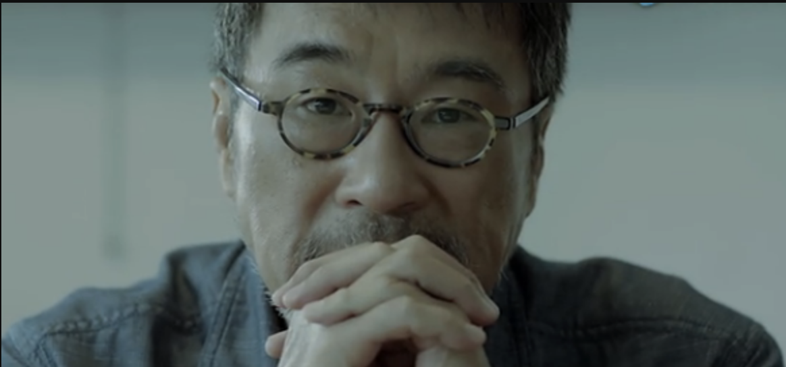
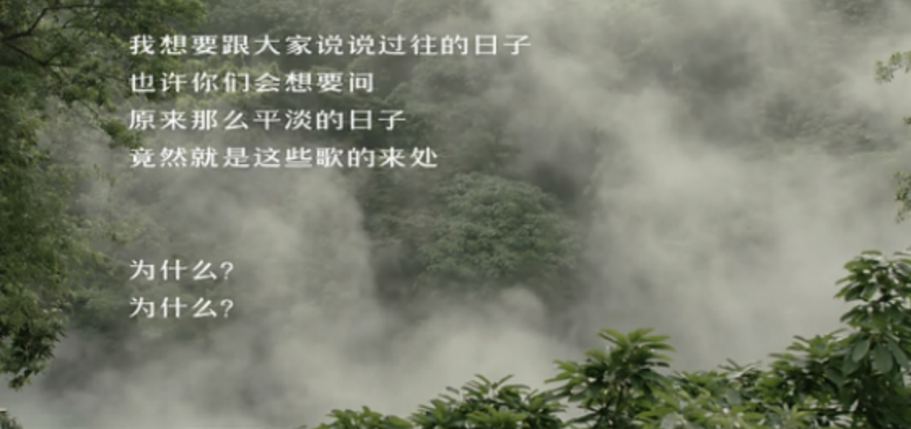
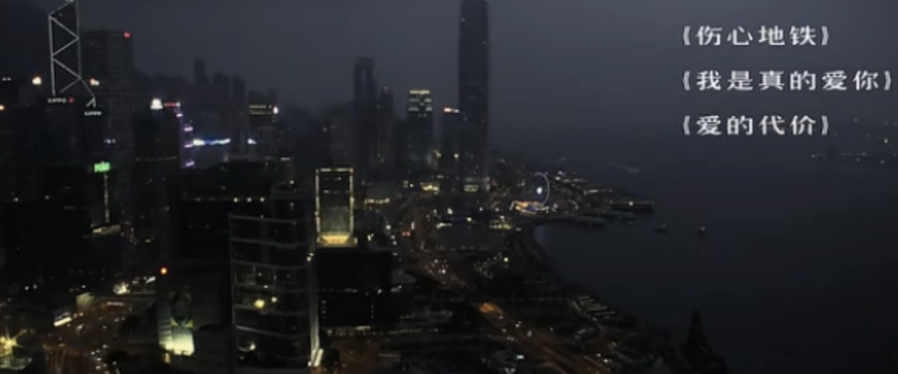
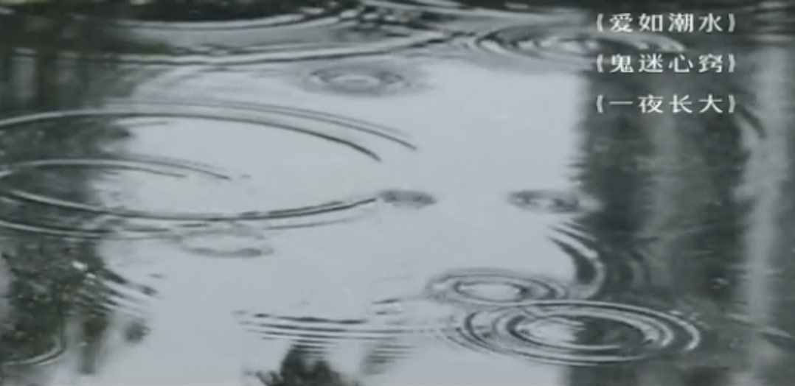
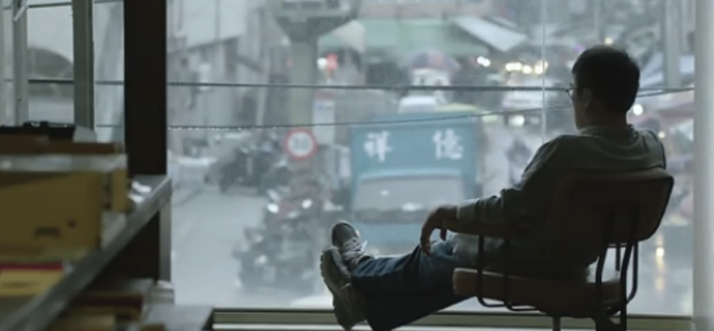
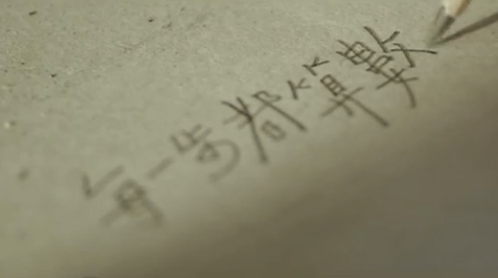

title: 致匠心
---

  
  

 
 
   

人生很多事急不得 你得等它自己熟
我20出头入行 30年写了不到300首歌
当然算是量少的
我想
一个人有多少天份 跟他出什么样的作品
并无太大关联
天分我还是有的
我有能耐住性子的天份

人不能孤独的活着
之所以有作品 是为了沟通
透过作品去告诉人家心里的想法
眼中看世界的样子
所在意的 珍惜的
所以 作品就是自己

所有精工制作的对象
最珍贵 不能替代的就只有一个字 人
人有情怀 有信念 有态度
所以 没有理所当然
就是要在各种变量可能之中
仍然做到最好

世界再吵杂
匠人的内心绝对必须是安静安定的
面对大自然赠与的素材
我得先成就它
它才有可能成就我

我知道
手艺人往往意味着
固执 缓慢 少量 劳作
但是这些背后所隐含的是
专注 技艺 对完美的追求
所以
我们宁愿这样 也必须这样 也一直这样
为什么
我们要保留我们最珍贵的 最引以为傲的

一辈子,总是还得让一些善意执念推着往前
我们因此能愿意去听从内心的安排
专注做点东西 至少对得起光阴岁月
其他的就留给时间去说吧!

      